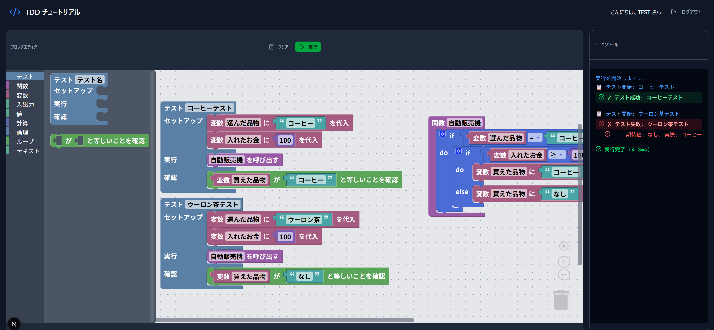

# TDD Tutorial

An interactive visual programming environment for learning Test-Driven Development (TDD) concepts using block-based coding.



## Features

### Block-Based Visual Editor
- **Blockly Integration**: Drag-and-drop block editor powered by Google Blockly
- **Custom TDD Blocks**: Specialized blocks for writing tests
  - Test Case block with Setup, Execute, and Assert sections
  - Assert Equals block for value comparison
  - Function Definition and Call blocks
  - Variable blocks (set, get, assign)
  - Print block for console output
- **Workspace Persistence**: Automatically saves your work to localStorage
- **Dark Theme**: Eye-friendly dark interface

### Interactive Features
- **Mouse Wheel Scrolling**: Scroll the workspace with mouse wheel
- **Ctrl+Wheel Zoom**: Zoom in/out with Ctrl + mouse wheel
- **Zoom Controls**: +/- buttons for precise zoom control

### Test Execution
- **Sandboxed Execution**: Safe code execution in isolated environment
- **Rate Limiting**: Protection against infinite loops (max 10 executions/minute)
- **Timeout Protection**: 5-second execution timeout
- **Visual Test Results**:
  - Green background for passing tests
  - Red background for failing tests
  - Clear spacing between test cases
  - Detailed error messages with expected vs actual values

### Console Output
- **Color-coded Messages**:
  - Blue: Test start / Info messages
  - Green: Test success
  - Red: Test failure / Errors
- **Execution Time**: Shows how long tests took to run
- **Auto-scroll**: Automatically scrolls to latest output

### Session Management
- **Simple Login**: Enter a nickname to start
- **Session Persistence**: Stay logged in during your session
- **Activity Tracking**: Automatic session refresh

## Tech Stack

- **Framework**: [Next.js](https://nextjs.org) 16 with App Router
- **Language**: TypeScript
- **Styling**: Tailwind CSS 4
- **Block Editor**: [Blockly](https://developers.google.com/blockly) 12
- **UI Components**: Radix UI primitives
- **Icons**: Lucide React
- **Validation**: Zod
- **Testing**: Vitest + Playwright

## Getting Started

### Prerequisites

- Node.js 18+
- npm, yarn, pnpm, or bun

### Installation

```bash
# Clone the repository
git clone <repository-url>
cd tdd-tutorial-rebuild

# Install dependencies
npm install
```

### Development

```bash
# Start development server
npm run dev
```

Open [http://localhost:3000](http://localhost:3000) in your browser.

### Testing

```bash
# Run unit tests
npm test

# Run tests with coverage
npm run test:coverage

# Run E2E tests
npm run test:e2e

# Run E2E tests with UI
npm run test:e2e:ui
```

### Build

```bash
# Create production build
npm run build

# Start production server
npm start
```

## Project Structure

```
src/
├── app/                    # Next.js App Router pages
│   ├── page.tsx           # Login page
│   ├── layout.tsx         # Root layout
│   └── workspace/         # Main workspace page
├── components/
│   ├── blockly/           # Blockly editor components
│   │   ├── blocks/        # Custom block definitions
│   │   ├── generators/    # JavaScript code generators
│   │   ├── blockly-editor.tsx
│   │   └── toolbox.ts     # Block categories
│   ├── console/           # Console output display
│   ├── auth/              # Login form
│   ├── layout/            # Header component
│   └── ui/                # Reusable UI components
├── hooks/                 # React hooks
│   ├── use-session.ts     # Session management
│   └── use-code-execution.ts
├── lib/                   # Utilities
│   ├── sandbox/           # Code execution sandbox
│   ├── session/           # Session manager
│   ├── validation/        # Code validation
│   └── errors/            # Error translation
└── types/                 # TypeScript types
```

## Custom Blocks

### Test Category
- **Test Case**: Define a test with name, setup, execute, and assert sections
- **Assert Equals**: Check if two values are equal

### Function Category
- **Function Definition**: Create a named function
- **Call Function**: Execute a defined function

### Variable Category
- **Set Variable**: Create and initialize a variable
- **Get Variable**: Read a variable's value
- **Assign Variable**: Update a variable's value

### I/O Category
- **Print**: Output text to console

## Usage Example

1. **Login**: Enter your nickname and click "Start"
2. **Create a Test**:
   - Drag a "Test Case" block to the workspace
   - Name your test (e.g., "Coffee Test")
3. **Setup**:
   - Add variable blocks to set up test conditions
4. **Execute**:
   - Call the function you want to test
5. **Assert**:
   - Use "Assert Equals" to verify results
6. **Run**: Click the green "Execute" button
7. **Check Results**: View test results in the console panel

## License

MIT
