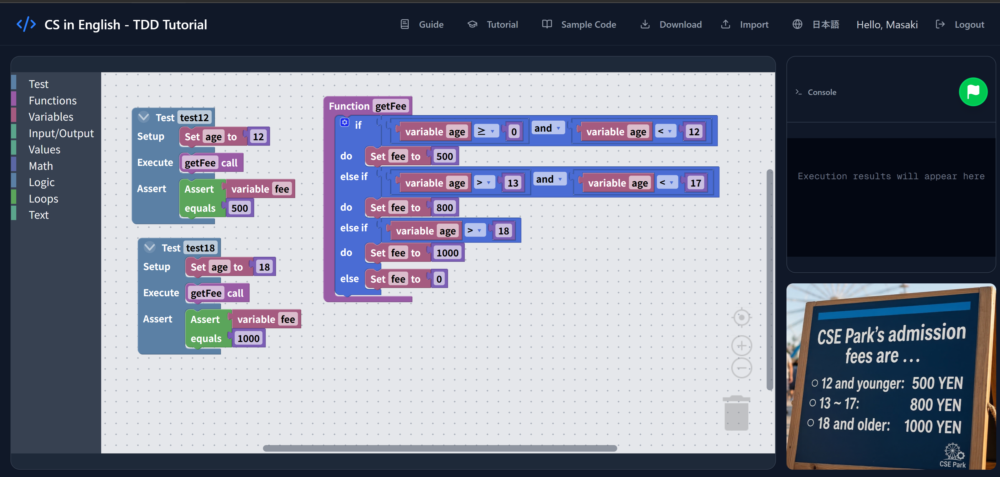

# TDD Tutorial

> **[日本語版はこちら / Japanese version](#日本語版)**

An interactive visual programming environment for learning Test-Driven Development (TDD) concepts using block-based coding, built for CS education.



## Overview

This web application uses [Google Blockly](https://developers.google.com/blockly) to provide a drag-and-drop programming experience where students can learn the TDD cycle — **write tests first, implement, then verify** — without writing text-based code.

**Target audience**: CS students (elementary through high school), supporting both English and Japanese programs.

### Core Concepts

1. **Test First**: Place test blocks before implementing function logic
2. **Visual Feedback**: Test results shown instantly via block colors (green = pass, red = fail) and error bubbles
3. **Progressive Learning**: Guide → Sample code insertion → Step-by-step tutorial → Free creation

## Features

### Block-Based Visual Editor
- **Blockly Integration**: Drag-and-drop block editor powered by Google Blockly 12
- **8 Custom TDD Blocks**: Test Case, Assert Equals, Function Definition, Call Function, Set/Assign/Get Variable, Print
- **9 Toolbox Categories**: Test, Functions, Variables, I/O, Values, Math, Logic, Loops, Text
- **Workspace Persistence**: Automatically saves/restores to localStorage
- **Dark Theme**: Custom dark Blockly theme with grid display

### Interactive Controls
- Mouse wheel scrolling on workspace
- Ctrl + mouse wheel zoom (0.3x - 3x)
- Zoom control buttons (+/-)
- Workspace export/import (JSON)
- Sample code insertion from header menu

### Test Execution
- **Sandboxed Execution**: Safe code execution via `new Function()` with custom console interception
- **Rate Limiting**: Max 10 executions per minute (sliding window)
- **Timeout Protection**: 5-second execution timeout
- **Code Validation**: Blocks dangerous patterns (eval, DOM access, network, etc.)
- **Visual Test Results**:
  - Block color changes (blue → green/red)
  - Error message bubbles attached to failing test blocks (follow on drag)
  - Console output with color-coded messages

### Console Output
- **Color-coded messages**: Blue (info), Green (success), Red (error), White (output)
- **Test result highlighting**: Green/red background on pass/fail lines
- **Execution time display** and auto-scroll

### Internationalization (i18n)
- **Bilingual**: Full Japanese and English support
- **React Context-based**: `I18nProvider` + `useI18n` hook
- **Dynamic switching**: All UI, blocks, generators, tooltips, and error messages update on locale toggle
- **Blockly re-registration**: Blocks and toolbox re-register on language change

### Guide & Tutorial
- **Guide page** (`/guide`): Visual walkthrough of all app features (10 sections)
- **Tutorial pages** (`/tutorial/en`, `/tutorial/ja`): Step-by-step TDD tutorial using an "Admission Fee" function
  - Build empty function → Write tests (RED) → Implement (GREEN) → Refactor
  - Includes fee table, screenshots, discussion questions

### Session Management
- Nickname-based login (2-20 chars, alphanumeric + Japanese characters)
- sessionStorage-based (auto-cleared on tab close)
- Activity tracking (60s interval refresh)

## Tech Stack

| Category | Technology | Version |
|----------|-----------|---------|
| Framework | [Next.js](https://nextjs.org) (App Router) | 16.x |
| UI | React | 19.x |
| Language | TypeScript | 5.x (strict) |
| Styling | Tailwind CSS | 4.x |
| UI Library | Radix UI, shadcn/ui base | - |
| Icons | Lucide React | 0.563+ |
| Block Editor | [Blockly](https://developers.google.com/blockly) | 12.x |
| Validation | Zod | 4.x |
| Unit Testing | Vitest | 4.x |
| E2E Testing | Playwright | 1.58+ |

## Getting Started

### Prerequisites

- Node.js 18+
- npm (or yarn, pnpm, bun)

### Installation

```bash
git clone <repository-url>
cd tdd-tutorial-rebuild
npm install
```

### Development

```bash
npm run dev
```

Open [http://localhost:3000](http://localhost:3000) in your browser.

### Testing

```bash
# Unit tests (watch mode)
npm test

# Unit tests (single run)
npm run test:run

# Unit tests with coverage
npm run test:coverage

# E2E tests
npm run test:e2e

# E2E tests (UI mode)
npm run test:e2e:ui
```

### Build

```bash
npm run build
npm start
```

## Project Structure

```
src/
├── app/                           # Next.js App Router
│   ├── layout.tsx                # Root layout (I18nProvider, dark theme, fonts)
│   ├── page.tsx                  # Login page (/)
│   ├── globals.css               # Global CSS + Blockly customization
│   ├── workspace/page.tsx        # Main workspace (/workspace)
│   ├── guide/page.tsx            # Usage guide (/guide)
│   └── tutorial/
│       ├── en/page.tsx           # English tutorial (/tutorial/en)
│       └── ja/page.tsx           # Japanese tutorial (/tutorial/ja)
│
├── components/
│   ├── blockly/
│   │   ├── blockly-editor.tsx    # Blockly editor (ref API)
│   │   ├── toolbox.ts            # Toolbox definition (9 categories)
│   │   ├── blocks/               # Custom block definitions (8 types)
│   │   ├── generators/           # JavaScript code generators
│   │   └── icons/                # Collapse icon for test cases
│   ├── console/                  # Console output panel
│   ├── auth/                     # Login form
│   ├── layout/                   # Header component
│   ├── tutorial/                 # Tutorial display component
│   └── ui/                       # shadcn/ui base components
│
├── hooks/
│   ├── use-session.ts            # Session management
│   └── use-code-execution.ts     # Code execution & test result parsing
│
├── lib/
│   ├── sandbox/                  # CodeExecutor, RateLimiter
│   ├── session/                  # Session CRUD
│   ├── validation/               # Forbidden pattern detection
│   ├── errors/                   # Error message translation
│   ├── sample-codes/             # Sample code registry
│   └── utils.ts                  # cn() utility
│
├── i18n/                         # I18nProvider, translations (ja/en)
├── guide/                        # Guide content (ja/en)
├── tutorial/                     # Tutorial content (ja/en)
└── types/                        # TypeScript type definitions

e2e/                              # Playwright E2E tests
```

## License

MIT

---

<a id="日本語版"></a>

# TDD チュートリアル（日本語版）

> **[English version is above / 英語版はこちら](#tdd-tutorial)**

Google Blocklyを使ったブロック型ビジュアルプログラミング環境で、TDD（テスト駆動開発）の考え方を体験学習できるWebアプリケーションです。CS教育向けに構築されています。


## 概要

ドラッグ＆ドロップのプログラミング体験を通じて、テキストコーディングなしでTDDの基本サイクル「**テストを書く → 実装する → テストを実行して検証する**」を体験できます。

**対象**: CS（コンピュータサイエンス）の授業を受ける生徒（主に小中高生）。英語プログラムと日本語プログラムの両方に対応。

### コアコンセプト

1. **テストファースト**: テストブロックを先に配置し、関数の中身を後から埋める
2. **視覚的フィードバック**: テスト結果がブロックの色（緑=合格、赤=失敗）とエラーバブルで即座にわかる
3. **段階的学習**: ガイド → サンプルコード挿入 → ステップバイステップチュートリアル → 自由制作

## 機能

### ブロック型ビジュアルエディタ
- **Blockly連携**: Google Blockly 12によるドラッグ＆ドロップブロックエディタ
- **8種類のカスタムTDDブロック**: テストケース、検証（Assert Equals）、関数定義、関数呼び出し、変数作成/代入/取得、出力
- **9つのツールボックスカテゴリ**: テスト、関数、変数、入出力、値、計算、論理、ループ、テキスト
- **ワークスペース永続化**: localStorageに自動保存/復元
- **ダークテーマ**: グリッド表示付きカスタムダークBlocklyテーマ

### インタラクティブ操作
- マウスホイールでワークスペーススクロール
- Ctrl + マウスホイールでズーム（0.3x〜3x）
- ズームコントロールボタン（+/-）
- ワークスペースのエクスポート/インポート（JSON）
- ヘッダメニューからサンプルコード挿入

### テスト実行
- **サンドボックス実行**: `new Function()` によるカスタムconsoleインターセプト付き安全実行
- **レート制限**: 1分間に最大10回（スライディングウィンドウ方式）
- **タイムアウト保護**: 5秒の実行タイムアウト
- **コード検証**: 危険なパターン（eval、DOM操作、ネットワーク等）をブロック
- **視覚的テスト結果**:
  - ブロック色の変化（青 → 緑/赤）
  - 失敗したテストブロックにエラーメッセージバブル表示（ドラッグ追従）
  - 色分けされたコンソール出力

### コンソール出力
- **色分けメッセージ**: 青（情報）、緑（成功）、赤（エラー）、白（出力）
- **テスト結果ハイライト**: 合格/失敗行に緑/赤の背景色
- **実行時間表示**、自動スクロール

### 国際化（i18n）
- **バイリンガル対応**: 日本語・英語の完全サポート
- **React Contextベース**: `I18nProvider` + `useI18n` フック
- **動的切替**: すべてのUI、ブロック、ジェネレータ、ツールチップ、エラーメッセージがロケール切替時に更新
- **Blockly再登録**: 言語変更時にブロックとツールボックスを再登録

### ガイド＆チュートリアル
- **ガイドページ**（`/guide`）: アプリ機能のビジュアル解説（10セクション）
- **チュートリアルページ**（`/tutorial/en`, `/tutorial/ja`）: 「入場料関数」を題材にしたステップバイステップTDDチュートリアル
  - 空の関数作成 → テスト記述（RED） → 実装（GREEN） → リファクタリング
  - 料金表、スクリーンショット、ディスカッション問題付き

### セッション管理
- ニックネームによるログイン（2〜20文字、英数字＋日本語対応）
- sessionStorageベース（タブを閉じると自動消失）
- アクティビティ追跡（60秒間隔）

## 技術スタック

| カテゴリ | 技術 | バージョン |
|---------|------|-----------|
| フレームワーク | [Next.js](https://nextjs.org)（App Router） | 16.x |
| UI | React | 19.x |
| 言語 | TypeScript | 5.x（strict） |
| スタイリング | Tailwind CSS | 4.x |
| UIライブラリ | Radix UI, shadcn/ui ベース | - |
| アイコン | Lucide React | 0.563+ |
| ブロックエディタ | [Blockly](https://developers.google.com/blockly) | 12.x |
| バリデーション | Zod | 4.x |
| ユニットテスト | Vitest | 4.x |
| E2Eテスト | Playwright | 1.58+ |

## セットアップ

### 前提条件

- Node.js 18以上
- npm（またはyarn, pnpm, bun）

### インストール

```bash
git clone <repository-url>
cd tdd-tutorial-rebuild
npm install
```

### 開発

```bash
npm run dev
```

ブラウザで [http://localhost:3000](http://localhost:3000) を開いてください。

### テスト

```bash
# ユニットテスト（ウォッチモード）
npm test

# ユニットテスト（単発実行）
npm run test:run

# カバレッジ付きユニットテスト
npm run test:coverage

# E2Eテスト
npm run test:e2e

# E2Eテスト（UIモード）
npm run test:e2e:ui
```

### ビルド

```bash
npm run build
npm start
```

## プロジェクト構造

```
src/
├── app/                           # Next.js App Router
│   ├── layout.tsx                # ルートレイアウト（I18nProvider, ダークテーマ, フォント）
│   ├── page.tsx                  # ログインページ（/）
│   ├── globals.css               # グローバルCSS + Blocklyカスタマイズ
│   ├── workspace/page.tsx        # メインワークスペース（/workspace）
│   ├── guide/page.tsx            # 使い方ガイド（/guide）
│   └── tutorial/
│       ├── en/page.tsx           # 英語チュートリアル（/tutorial/en）
│       └── ja/page.tsx           # 日本語チュートリアル（/tutorial/ja）
│
├── components/
│   ├── blockly/
│   │   ├── blockly-editor.tsx    # Blocklyエディタ本体（ref API公開）
│   │   ├── toolbox.ts            # ツールボックス定義（9カテゴリ）
│   │   ├── blocks/               # カスタムブロック定義（8種類）
│   │   ├── generators/           # JavaScriptコード生成
│   │   └── icons/                # テストケース折りたたみアイコン
│   ├── console/                  # コンソール出力パネル
│   ├── auth/                     # ログインフォーム
│   ├── layout/                   # ヘッダコンポーネント
│   ├── tutorial/                 # チュートリアル表示コンポーネント
│   └── ui/                       # shadcn/ui ベースコンポーネント
│
├── hooks/
│   ├── use-session.ts            # セッション管理
│   └── use-code-execution.ts     # コード実行・テスト結果解析
│
├── lib/
│   ├── sandbox/                  # CodeExecutor, RateLimiter
│   ├── session/                  # セッションCRUD
│   ├── validation/               # 禁止パターン検出
│   ├── errors/                   # エラーメッセージ翻訳
│   ├── sample-codes/             # サンプルコードレジストリ
│   └── utils.ts                  # cn() ユーティリティ
│
├── i18n/                         # I18nProvider, 翻訳（ja/en）
├── guide/                        # ガイド内容（ja/en）
├── tutorial/                     # チュートリアル内容（ja/en）
└── types/                        # TypeScript型定義

e2e/                              # Playwright E2Eテスト
```

## ライセンス

MIT
